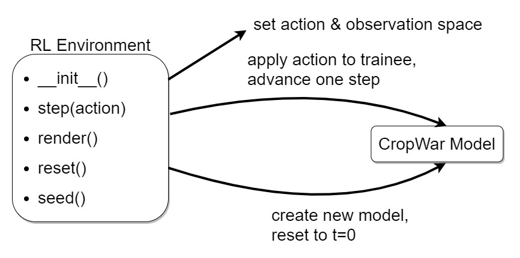

RL Environment
--------------

Necessary for any reinforcement learning is an environment. 
It interacts with the CropWar model and has the OpenAI Gym environment structure as shown in this figure:

We wrapped the agentpy model into this environment:

.. automodule:: RL_env
    :members: