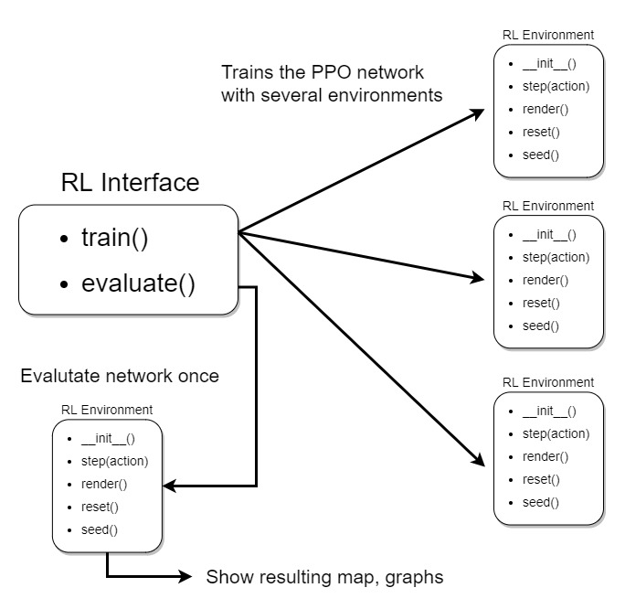

Overview
========

Within the vast area of machine learning (ML), reinforcement learning describes learning paradigms that focus on optimal decision-making of intelligent agents. 

The decision in RL are modelled with Markov chain processes (MC). 
The main constituents are the agents, an environment in which the actions take place, states of the agents and an interpreter which determines and interprets the actions of each agent.

In this project, we chose the Proximal Policy Optimization (PPO) algorithm. 
This is mainly because PPO is suited for environments with discrete time steps, continuous observation space and discrete action space as in our model. 
For the software implementation, we follow StableBaselines 3 (SB3) example for PPO algorithms.

As suggested in the documentation of SB3, training was initially performed using the default hyperparameters and the MlpPolicy of SB3. 
By using TensorBoard to track the learning, we could visually check the agent's performance with the evolution of the mean reward. 
If no asymptote was reached, the number of steps were increased. By tweaking the learning rate over three orders of magnitudes, we found the default one of 0.0003 to be stable. 
The number of parallel environments was increased to eight, in order to get a diverse set of initial seeds. This produced high rewards and interesting behaviour.

The structure of the implemented reinforcement learning is very simple, thanks to the SB3 libraries. This way our code can be as simple as abstractly shown here:

Main Functions
----------------
The main functions used to train and visualise the results are:

.. autofunction:: RL_interface.run_trainer

.. autofunction:: RL_interface.evaluate
