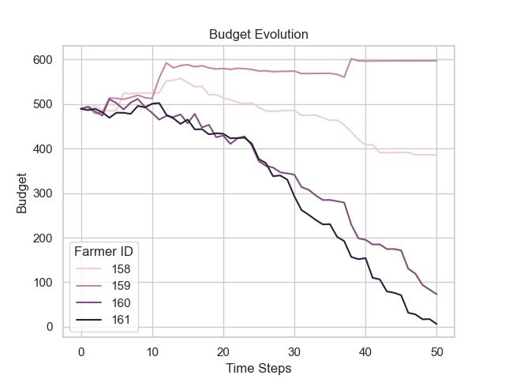
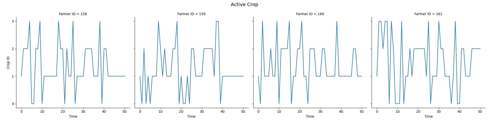
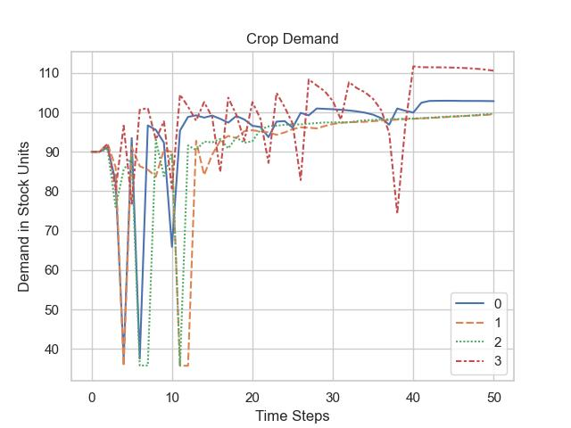

Graph Visualisation
===================

Graphs are used to visualise interesting Farmer parameters. 

.. Note:: During the AgentPy simulation properties are stored internally with ``record()`` functions during the ``update()`` calls. Once the simulation has ended, the results are handed over to the ``graph_presenter`` which then visualises them.

Implementation
--------------

.. automodule:: graph_presenter
    :members:
    :private-members:

Example Output
---------------

The output generated by the graph presenter looks as follows:

.. Hint:: The raw data of the plots are exported to `.csv` files for custom plotting.

.. image:: img/10.jpg
   :width: 255pt

.. image:: img/02.jpg
   :width: 255pt

.. image:: img/03.jpg
   :width: 510pt

.. image:: img/09.jpg
   :width: 255pt

.. image:: img/08.jpg
   :width: 255pt

.. image:: img/06.jpg
   :width: 255pt