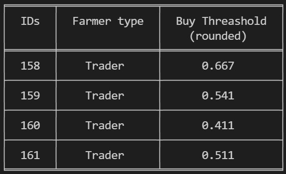
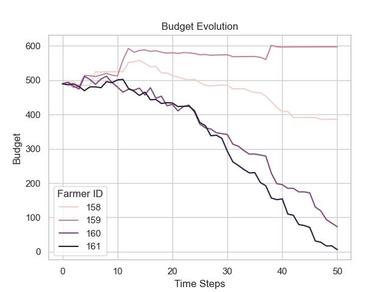
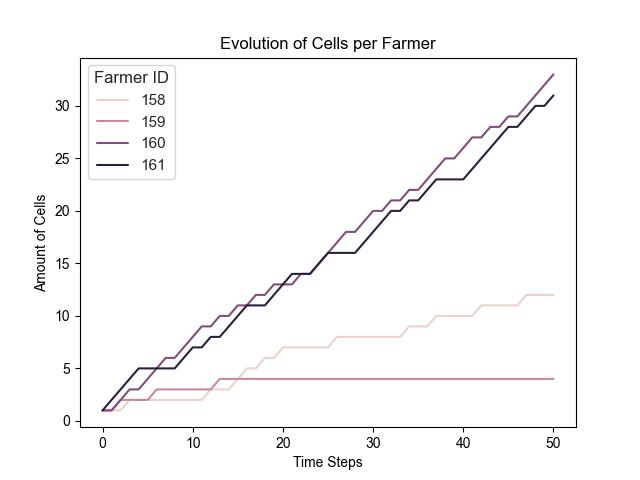
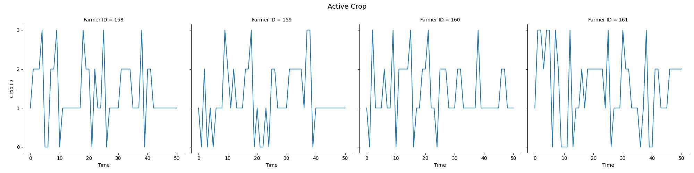
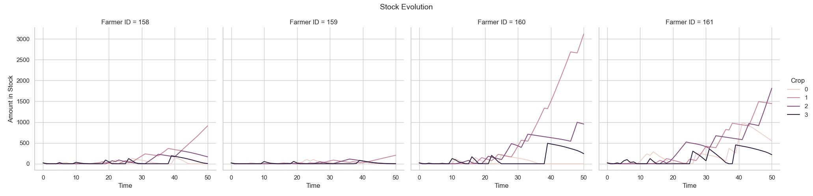
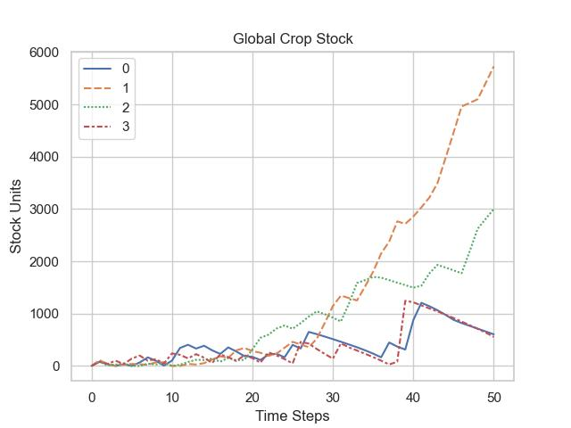
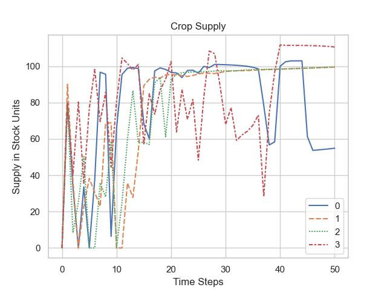
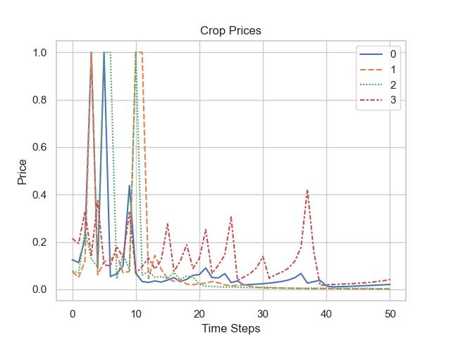

.. CropWar documentation master file, created by
   sphinx-quickstart on Fri Nov 26 17:48:20 2021.
   You can adapt this file completely to your liking, but it should at least
   contain the root `toctree` directive.

Welcome to CropWar's documentation!
===================================

Here you can find instructions on how to simulate the interactions of spatially and economically competing farmers : :guilabel:`The CropWar`

.. image:: img/map.gif
   :width: 255pt

.. image:: img/07.jpg
   :width: 255pt

Simulation Pseudo Code
----------------------

.. code-block:: Python

   """ Initialise the available crops """
   crop_shop = CropSortiment()
   crop_shop.add_crop(1, 1, 1)  
   crop_shop.add_crop(1, 2, 1)  

   parameters = {
      # ...
      # Parameters, specifing the model properties
      # ...

   }

   """ Create and run the model """
   model = CropwarModel(parameters)  
   results = model.run()

   """ Display the results using the Displayer Class """
   presenter = graph_class(results)
   presenter.crops()
   presenter.cellcount()
   presenter.stocks()
   presenter.budget()
   presenter.export()
   presenter.traits(model)

   """ Display the Map with the farmers """
   mapper = map_class(model)
   mapper.initialise_farmers()
   mapper.place_farmers()
   mapper.show()

   print(f"SEED: {model.p.seed}")

The settings used for the results up above are the following:

.. code-block:: Python

   "parameters": {
      # ---- MAP ----
      "water_levels": [0, 0, 3],
      "v0_pos" : None, # <- assign random initial positions
      # "v0_pos": sorted(
            [
               (1, 1),
               (1, 4),
               (5, 1),
               (5, 4),
            ],
            key=lambda x: x[0],
      ),
      # ---- General Simulation Settings ----
      "crop_shop": None,
      "amount_of_crops": None,
      "steps": 50,  # Amount of time steps
      "diagonal expansion": False,  # Only expand along edges
      "save_gif": True,  # Save map as Gif
      "seed": b'j\xa9\xe60\x1e8\xd8^Y,',  # Use a custom seed
      "farmers": {Trader: 4, Introvert: 0, ML_Expander: 0},
      # ---- ML Parameters ----
      "ml_env": None,  # spec in RL_env
      "trainee_type": None,
      "use_trained_model": False,
      # ---- Parameters ----
      "max_stock": 2e5,
      "max_budget": 1e8,
      "start_budget": 500.0,
      "river_content": 100.0,
      "market_base_demand": 90.0,
      "market_base_supply": 50.0,
      "market_max_price": 1.0,
      "market_demand_growth_factor": 1e-3,
      "market_price_sensitivity": 1.0,
      "farmer_price_elasticity": 10.0,
      "farmer_starting_stock": 20.0,
   },
   

.. Tip:: Read through the documentation accessible in the sidebar to understand what happens behind the scenes. :)

.. toctree::
   :maxdepth: 2
   :caption: User Guide

   overview

   INFO_model
   INFO_market
   INFO_crops
   INFO_weather

.. toctree::
   :maxdepth: 2
   :caption: Reinforcement Learning

   INFO_SB3 
   INFO_RL_env

.. toctree::
   :maxdepth: 2
   :caption: Visualisation

   VIS_graphs
   VIS_map
   
.. toctree::
   :maxdepth: 2
   :caption: Documentation

   code/modules
   api

Indices and tables
==================

* :ref:`genindex`
* :ref:`modindex`
* :ref:`search`
